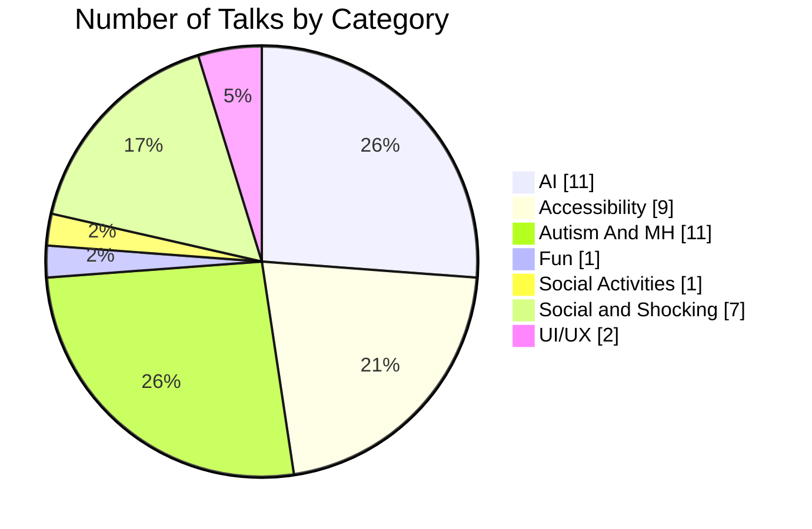

# Talks by Category

| Category             | Number of Talks |
|----------------------|-----------------|
| [AI](AI/AI.md)       | 11              |
| [Accessibility](Accessibility/Accessibility.md) | 9 |
| [Autism And MH](AutismAndMH/AutismAndMH.md) | 11 |
| [Fun](Fun/Fun.md)    | 1               |
| [Social Activities](SocialActivities/SocialActivities.md) | 1 |
| [Social and Shocking](SocialAndShocking/SocialAndShocking.md) | 7 |
| [UI/UX](UIUX/UIUX.md) | 2 |

# BIO

Dennie is Microsoft MVP in AI and Developer Technologies and has experience in accessibility with Microsoft technologies. In daily life Dennie is president and developer at DDSoft, a nonprofit that connects IT to People who are less tech-savvy. Dennie invented technical solutions and systems to help people with disabilities to participate in their daily life. Thanks to his autism he's the right man at the right spot to contribute as a volunteer in function of people with disabilities.

# CFP Deadlines

[CFP Deadlines](CFPDEADLINES.md)
